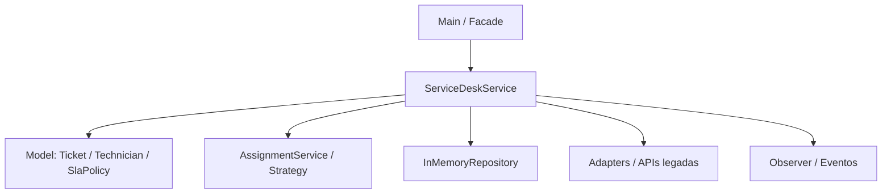
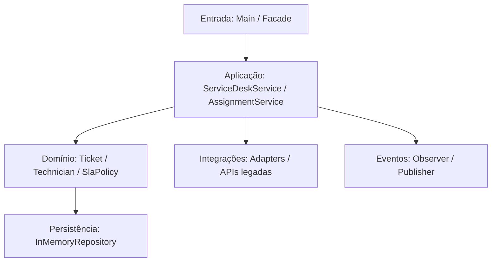

# ServiceNowX — Aula 06 — Análise Arquitetural

## 1. Identificação

- **Projeto:** ServiceNowX
- **Grupo:** Projeto ServiceNowX
- **Integrantes:** conforme cadastro do grupo
- **Data:** setembro/2026

## 2. Arquitetura atual

A análise do código identifica **Arquitetura em Camadas** como o estilo arquitetural predominante.

### 2.1 Estrutura identificada

- `model`: entidades do domínio;
- `service`: regras e orquestração do atendimento;
- `repository`: persistência em memória;
- `patterns/strategy`: seleção de técnico;
- `patterns/adapter`: adaptação de APIs legadas;
- `patterns/factory`: criação de tickets;
- `patterns/observer`: publicação de eventos;
- `patterns/facade`: fachada de acesso;
- `legacy`: integrações externas simuladas.

### 2.2 Evidências

1. `src/main/java/br/edu/servicenowx/model/Ticket.java`
2. `src/main/java/br/edu/servicenowx/service/ServiceDeskService.java`
3. `src/main/java/br/edu/servicenowx/repository/InMemoryRepository.java`
4. `src/main/java/br/edu/servicenowx/patterns/strategy/AssignmentService.java`
5. `src/main/java/br/edu/servicenowx/patterns/adapter/DirectoryAdapter.java`
6. `src/main/java/br/edu/servicenowx/patterns/facade/ServiceNowXFacade.java`

### 2.3 Diagrama

## 3. Requisitos funcionais analisados

| ID | Requisito funcional | Evidência |
|---|---|---|
| RF02 | Calcular prazo de SLA conforme prioridade e `openedAt`. | `ServiceDeskService.calculateDue()` |
| RF05 | Controlar disponibilidade do técnico durante o atendimento. | `ServiceDeskService.assign()` e `resolve()`; `Technician.available` |
| RF07 | Resolver somente chamado com técnico atribuído. | `ServiceDeskService.resolve()` |
| RF10 | Publicar eventos relevantes do ciclo do chamado. | `TicketPublisher` e chamadas em `ServiceDeskService` |

## 4. Requisitos não funcionais analisados

| ID | RNF | Verificação |
|---|---|---|
| RNF03 | Testes automatizados com JUnit 5. | `mvn clean test` |
| RNF05 | Consistência do estado dos técnicos. | Testes de atribuição/resolução e inspeção de `activeTickets`/`available`. |
| RNF07 | Separação de responsabilidades. | Inspeção dos pacotes `model`, `service`, `repository`, `patterns` e `legacy`. |
| RNF08 | Regras testáveis independentemente da interface. | `ServiceDeskServiceTest.java`. |
| RNF10 | Alterações verificáveis antes da entrega. | `mvn clean compile` e `mvn clean test`. |

## 5. Relação RNF × arquitetura

| RNF | Parte afetada | Justificativa |
|---|---|---|
| RNF03 | `src/test/java` + Maven | A separação permite testar o serviço diretamente. |
| RNF05 | `service` + `model` | Estado de técnico é alterado pelas regras do ciclo do chamado. |
| RNF07 | `model/service/repository/patterns/legacy` | Cada pacote possui uma responsabilidade predominante. |
| RNF08 | `service` + testes | As regras podem ser exercitadas sem interface. |
| RNF10 | Maven + testes | A arquitetura e o build permitem verificar o comportamento antes da entrega. |

## 6. Problema arquitetural identificado

### Problema

A documentação inicial dizia apenas “arquitetura moderna e escalável” e não registrava alternativas, critérios ou evidências. Além disso, algumas responsabilidades ficam concentradas em `ServiceDeskService`, especialmente acesso às APIs legadas.

### Evidência

`ServiceDeskService.java` instancia diretamente `DirectoryLegacyApi`, `MonitoringLegacyApi`, `NotificationLegacyApi` e `VendorSupportLegacyApi`, além de coordenar abertura, atribuição, resolução, escalonamento e ingestão de monitoramento.

### Consequência

O crescimento do serviço pode aumentar acoplamento e dificultar substituição das integrações. A evolução proposta é manter as camadas e reforçar as fronteiras por meio dos adapters/fachadas já existentes.

## 7. Alternativas

- **A:** Arquitetura em Camadas;
- **B:** Monolítico sem separação explícita;
- **C:** Microserviços.

## 8. Matriz

Ver `docs/MODELO-MATRIZ-DECISAO.md`.

## 9. Justificativas

Ver `docs/MODELO-JUSTIFICATIVAS-NOTAS.md`. Todas as notas da matriz possuem justificativa e evidência do projeto.

## 10. Decisão arquitetural

**Manter e formalizar Arquitetura em Camadas.**

A alternativa obteve a maior pontuação (63). A decisão também considera que o sistema é uma única aplicação Java/Maven, sem necessidade comprovada de distribuição.

## 11. Trade-off

- **Ganho:** separação, testabilidade e manutenção com baixo custo operacional.
- **Custo:** não permite escalar componentes de forma independente como microserviços.
- **Trade-off aceito:** para o estágio atual, a simplicidade e a testabilidade são mais relevantes que a distribuição independente.

## 12. Arquitetura proposta

A proposta preserva a estrutura atual e torna explícitas as fronteiras das responsabilidades.

## 13. Conclusão

O grupo identificou Arquitetura em Camadas no código real, analisou requisitos funcionais e não funcionais, comparou três alternativas, justificou todas as notas e decidiu manter/formalizar a arquitetura em camadas. A decisão é adequada ao ServiceNowX neste momento porque melhora organização e testabilidade sem introduzir a complexidade operacional de uma solução distribuída.
